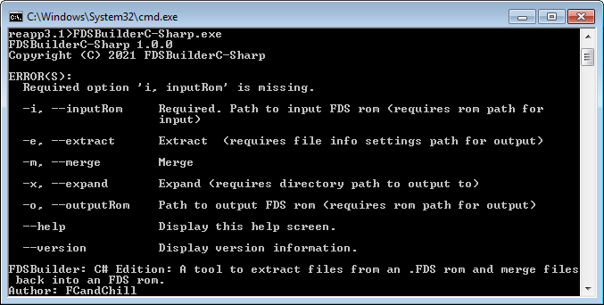

# FDSBuilder C# Edition

## About



This program is an open source option / replacement to "[FDS Expander](https://www.romhacking.net/utilities/702/)", "[FDS Builder, Sequential Version](https://www.romhacking.net/utilities/747/)", and "[FDS Builder, ID version](https://www.romhacking.net/utilities/302/)" by [KingMike](https://www.romhacking.net/community/76/). This was programmed in one day, so there's likely going to be bugs.

Programmed by FCandChill.

## Program Parameters
* inputDiskImage
    * After this paramter, specify the filepath to the FDS disk image file.
* outputDiskImage
    * After this paramter, specify the filepath to the output FDS disk image file.
	* Use this when using the "merge" or "expand" parameters.
* extract
    * This parameter indicates you want to extract files from the FDS images.
* merge
    * Specifies you want to create an FDS disk image from the previously extracted FDS files.
* extractDirectory
    * Directory where extracted FDS files (each side will have its own dedicated directory) and JSON settings file ("fileInfo.json" ) are.
* expand
    * This parameter indicates you want to expand the files of your FDS  disk image file. The program simply adds X number of bytes to the end of your file.
    * After this parameter, include the path to the file with the information to expand your file. Here's a sample of one:
  
```
[
  [
    {
      "fileNumber": 4,
      "bytesToAdd": 348
    },
    {
      "fileNumber": 7,
      "bytesToAdd": 512
    }
  ],
  [
    {
      "fileNumber": 0,
      "bytesToAdd": 83
    },
    {
      "fileNumber": 1,
      "bytesToAdd": 256
    }
  ]
]
```
* outputRom
    * Include the path to the file you want to write your new FDS disk image to.

## Example scripts
Put these in a .bat file.

### Extraction example
Extract FDS files from a FDS disk image.
```
::Disk Image
set baseImage=roms\diskImage.fds

::Folders
set projectFolder=C:\Project Folder
set FDSBuilderFolder=C:\FDS Builder Folder

cd "%projectFolder%"

:: FDS Builder
"%FDSBuilderFolder%\FDSBuilderC-Sharp.exe" ^
--inputDiskImage "%projectFolder%\%baseImage%" ^
--extract ^
--extractDirectory "%projectFolder%\disks\original"
```

### Merge example
Merge FDS disk images files after you extracted them:

```
::Roms
set baseImage=roms\rom.fds
set moddedImage=new.fds

::Folders
set projectFolder=C:\Project Folder
set FDSBuilderFolder=C:\FDS Builder Folder

cd "%projectFolder%"

:: FDS Builder
"%FDSBuilderFolder%\FDSBuilderC-Sharp.exe"
--inputDiskImage "%projectFolder%\%baseImage%" ^
--outputDiskImage "%projectFolder%\%moddedImage%" ^
--merge ^
--diskDirectory "%projectFolder%\disks\patched"
```

### Expand example
```
::Roms
set baseImage=roms\rom.fds
set moddedImage=new.fds

::Folders
set projectFolder=C:\Project Folder
set FDSBuilderFolder=C:\FDS Builder Folder

cd "%projectFolder%"

::Expand FDS rom
"%FDSBuilderFolder%\FDSBuilderC-Sharp.exe" ^
--inputDiskImage "%projectFolder%\%baseImage%" ^
--outputDiskImage "%projectFolder%\%moddedImage%" ^
--expand "%projectFolder%\expansion.json"
```

## Binary Info
These are the bare essential files to make the program run. I don't know how or why "FDSBuilderC-Sharp.dll" is generated after compiling, but it would be best if there was a way to not generate it.

* FDSBuilderC-Sharp.exe
* FDSBuilderC-Sharp.dll
* CommandLine.dll
* Newtonsoft.Json.dll
* FDSBuilderC-Sharp.runtimeconfig.json

## References
* https://wiki.nesdev.com/w/index.php/FDS_disk_format
* https://forums.nesdev.com/viewtopic.php?p=194867#p194867
